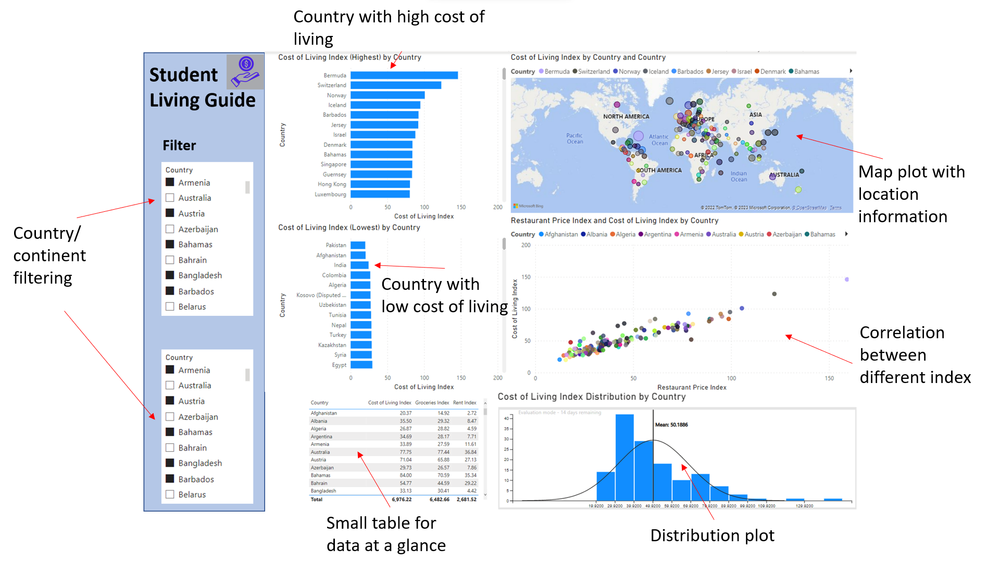

# Student Living Guide

The [Student Living Guide](https://caesarwong.shinyapps.io/Student_Living_Guide_Shiny/) app is created to help students studying in New York who are looking to explore new countries to travel to during their vacations or to move to after graduating. We have information about the cost of living in different countries in the form of different indexes which we will make available in our app in a very user-friendly and understandable format through a dashboard!

This app consists of a basic filter that filters the entire dashboard for specific countries or continents. But the highlight of this dashboard would be its ability to compare the different indexes across multiple countries and continents.

We plan on having four graphs that will summarize the entire dataset and help analyze the students in order to make their next move. It will not only be comprehensive but also be made simple so that anyone can understand and make use of it.

The first graph is a bar chart in the top left corner (beside the filters) depicting the 10 with the highest and lowest Cost of Living index. The two charts - highest and lowest Cost of Living are placed one on top of the other. The second graph is a map that will be on the top right corner capturing the Cost of Living Index of each country on the world map. The magnitude of the value is shown by the size of the circle. The third graph comes directly below it and will tell us if there is a direct correlation between some of the features for eg. there seems to be a high dependence of the restaurant index with the cost of living index. The fourth graph is a probability distribution plot of the cost of living index of all the countries.



# Usage

General steps for reproducing the data preprocessing.

1. Clone [this](https://github.com/UBC-MDS/Student_Living_Guide.git) GitHub repository

```
git clone https://github.com/UBC-MDS/Student_Living_Guide.git
```

2. Navigate to the GitHub repository

```
cd Student_Living_Guide
```

3. Install the required python packages listed in [here](https://github.com/UBC-MDS/Student_Living_Guide/blob/main/requirements.txt) 

```
pip install -r env/requirements.txt
```

4. Run the data preprocessing script

```
python src/preprocessing.py --input_path="data/raw_data.csv" --output_path="data/processed_data.csv"
```


# Requirements

Required Python packages for data preprocessing.

```
pycountry-convert==0.7.2    # for obtaining the Continent
geopy==2.3.0                # for obtaining the latitude, longitude
pandas>=1.3.*               # for dataframe reading & storing
```


# Developing the app locally

Interested in contributing to the project? This section provides instructions on how to install and configure the necessary tools and dependencies to get started. 

To develop `Student_Living_Guide` locally:
1. Clone this repository 
```   
git clone https://github.com/UBC-MDS/Student_Living_Guide.git
```
1. Install R and RStudio on your local machine.
2. Open RStudio and set the current working directory to where you clone the repo.
3. Install all the dependencies by running the following code in the R console: 
```
install.packages(c("shiny", "shinyjs", "shinydashboard", "shinythemes", "shinycssloaders", "shinyWidgets", "leaflet", "plotly", "circlize", "ggplot2"))
```
4. To run the app locally, run the following command in the R console:
```
runApp("Student_Living_Guide_Shiny")
```
5. Alternatively, you can navigate into the folder `Student_Living_Guide_Shiny` and open the `app.R` script. Then, click on the Run App button at the top of the editor.
   
6. The script for the `ui` objects is located in `Student_Living_Guide_Shiny\ui\tab1.R` while the script for the `server` function is located in `Student_Living_Guide_Shiny\ui\tab1.R`.

# Contributions
Interested in contributing? Please check out our [contributors' guidelines](CONTRIBUTING.md). 

It is important to maintain a welcoming and respectful environment while you contribute to the project. Before contributing, please take a moment to review the [code of conduct](CODE_OF_CONDUCT.md) to ensure that your contributions align with our values.

# License
Licensed under the terms of the MIT license.
Cost of Living dataset taken from https://www.numbeo.com/cost-of-living/rankings.jsp
