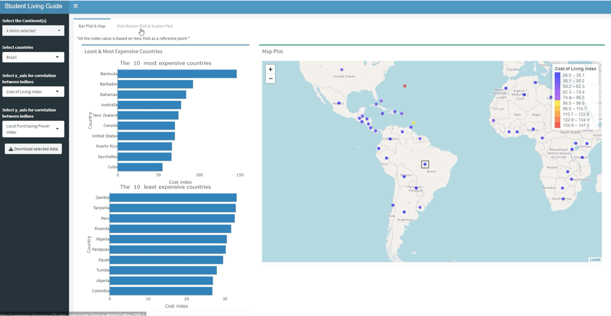

# Student Living Guide

[](https://github.com/UBC-MDS/Student_Living_Guide/actions/workflows/deploy-app.yaml)[](https://github.com/UBC-MDS/Student_Living_Guide/actions/workflows/testing.yaml)

The [Student Living Guide](https://caesarwong.shinyapps.io/Student_Living_Guide_Shiny/) app is created to help students studying in New York who are looking to explore new countries to travel to during their vacations or to move to after graduating. We have information about the cost of living in different countries in the form of different indexes which we will make available in our app in a very user-friendly and understandable format through a dashboard!

This app consists of a basic filter that filters the entire dashboard for specific countries or continents. But the highlight of this dashboard would be its ability to compare the different indexes across multiple countries and continents.

We have four graphs that will summarize the entire dataset and help analyze the students in order to make their next move. It will not only be comprehensive but also be made simple so that anyone can understand and make use of it.


#
The following table of contents provides a overview of the Student Living Guide app and its different sections, you can use the links below to easily navigate to the section of interest.

- [Introduction](#student-living-guide)
- [Dashboard Demo](#how-to-use-this-dashboard)
- [Reproducing the processed data](#usage)
- [Required Python packages for data preprocessing](#requirements)
- [Developing the app locally](#developing-the-app-locally)
- [Contributions](#contributions)
- [License](#license)


# How to use this dashboard


When you open the dashboard, you will be directed to the default Bar plot & Map tab, which will show three graphs:

- The first graph is a bar chart located in the top left, beside the filters. This bar chart depicts the 10 countries with the highest and lowest Cost of Living index.
- A second bar chart located directly below the first one, which also depicts the 10 countries with the highest and lowest Cost of Living index.
- A map located on the right side of the app, which captures the Cost of Living Index of each country on the world map. The magnitude of the index is indicated by the color of the circle. You can hover over each data point map to see more information about a specific country and also drag around to click on another country of interest.

In addition to using the map, you can also use the country selector locates in the side panel.



To access the second tab, click on the "Distribution Plot & Scatter Plot" located at the top of the dashboard. The second tab contains two graphs.

- The graph on the left is a scatter plot that shows the correlation between selected indices and the selector for those indices are located in the side panel.
- The graph on the right is a probability distribution plot of the Cost of Living index of all the countries.

Using the continent selector will update both the scatter plot and the distribution plot. When a country is selected, the distribution plot will show the cost of living index for that country as a red dashed line. It  will also show the distribution of cost of living indices for all countries in the selected continent, and the mean cost of living index for the selected continents as a solid black line.

The dashboard is designed to be responsive, so you can resize the window or view it on different devices without losing any functionality.


# Usage

General steps for reproducing the data preprocessing.

1. Clone [this](https://github.com/UBC-MDS/Student_Living_Guide.git) GitHub repository

```
git clone https://github.com/UBC-MDS/Student_Living_Guide.git
```

2. Navigate to the GitHub repository

```
cd Student_Living_Guide
```

3. Install the required python packages listed in [here](https://github.com/UBC-MDS/Student_Living_Guide/blob/main/requirements.txt) 

```
pip install -r env/requirements.txt
```

4. Run the data preprocessing script

```
python src/preprocessing.py --input_path="data/raw_data.csv" --output_path="data/processed_data.csv"
```


# Requirements

Required Python packages for data preprocessing.

```
pycountry-convert==0.7.2    # for obtaining the Continent
geopy==2.3.0                # for obtaining the latitude, longitude
pandas>=1.3.*               # for dataframe reading & storing
```


# Developing the app locally

If you are interested in running or developing the app locally, this section provides instructions on how to install and configure the necessary tools and dependencies to get started. 

To develop `Student_Living_Guide` locally:
1. Clone this repository 
```   
git clone https://github.com/UBC-MDS/Student_Living_Guide.git
```
2. Install R and RStudio on your local machine.
3. Open RStudio and set the current working directory to where you clone the repo.
4. Install all the dependencies by running the following code in the R console: 
```
install.packages(c("shiny", "shinyjs", "shinydashboard", "shinythemes", "shinycssloaders", "shinyWidgets", "leaflet", "plotly", "circlize", "ggplot2"))
```
5. To run the app locally, run the following command in the R console:
```
runApp("Student_Living_Guide_Shiny")
```
6. Alternatively, you can navigate into the folder `Student_Living_Guide_Shiny` and open the `app.R` script. Then, click on the Run App button at the top of the editor.
   
7. The script for the `ui` objects is located in `Student_Living_Guide_Shiny\ui\tab1.R` while the script for the `server` function is located in `Student_Living_Guide_Shiny\ui\tab1.R`.

# Contributions
Interested in contributing? Please check out our [contributors' guidelines](CONTRIBUTING.md). 

It is important to maintain a welcoming and respectful environment while you contribute to the project. Before contributing, please take a moment to review the [code of conduct](CODE_OF_CONDUCT.md) to ensure that your contributions align with our values.

# License
Licensed under the terms of the MIT license.
Cost of Living dataset taken from https://www.numbeo.com/cost-of-living/rankings.jsp
